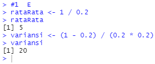
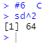

# P1_Probstat_F_5025201097
Repository pengumpulan jawaban Praktikum Probstat 2022.

## Identitas
Nama : Benedictus Bimo C W 
NRP : 5025201097 
Kelas : Probstat F 

## Laporan Praktikum
### Soal 1
#### - A
Dilakukan penghitungan dengan fungsi `dgeom()` dengan parameter x dan p yang masing-masing bernilai 3 dan 0,2. 

#### - B
Dilakukan penghitungan dengan fungsi `mean()` dan `rgeom()` dengan p yang sama dan n bernilai 1000. 

#### - C
Perbedaan hasil pada poin A dan B tidak terlalu signifikan. Namun pada poin B, didapatkan hasil yang berubah-ubah.

#### - D
Dilakukan pemanggilan fungsi `hist()` dan `rgeom()` yang sama seperti penyelesaian poin B. 

#### - E
Dilakukan penghitungan rataRata dan variansi dengan masing-masing rumusnya. 

### Soal 2
#### - A
Dilakukan penghitungan dengan fungsi `dbinom()` dengan parameter n, p, dan x yang masing-masing bernilai 20, 0,2, 4. 

#### - B
Dilakukan pemanggilan fungsi `hist()` dan `rbinom` dengan parameter sama n, p, dan x. 

#### - C
Dilakukan penghitungan rataRata dan varian dengan masing-masing rumusnya. 

### Soal 3
#### - A
Dilakukan penghitungan dengan fungsi `dpois()` dengan parameter n dan lambda. 

#### - B
Dilakukan pemanggilan fungsi `hist()` dan `rpois()`. 

#### - C
Nilai distribusi Poisson tidak berubah.

#### - D
Dilakukan penyesuaian isi lambda dengan rataRata dan var. 

### Soal 4
#### - A
Dilakukan penghitungan dengan fungsi `dchisq()` dengan parameter x dan 10. 

#### - B
Dilakukan pemanggilan fungsi `hist()` dan `rchisq()`. 

#### - C
Dilakukan penghitungan rataRata dan variansi dengan setiap rumusnya. 

### Soal 5
#### - A
Dilakukan pemanggilan fungsi `dexp()`. 

#### - B
Dilakukan `set.seed()` dan input random pada `hist()`. 

#### - C
Dilakukan penyesuaian isi lambda dengan rataRata dan var. 

### Soal 6
#### - A
Dilakukan penghitungan Z-Score dan plot data random ke dalam grafik. 

#### - B
Dilakukan pemanggilan fungsi `hist()` dengan main sesuai format yang telah ditentukan. 

#### - C
Dilakukan pengkuadratan sd. 

